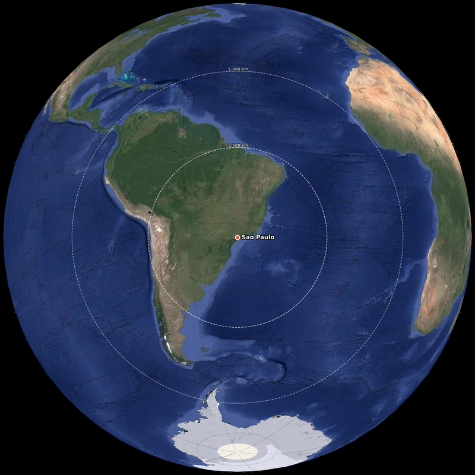

# Orthographic Map Generator

This project generates high-resolution orthographic globe images centered on a selected major city using Cartopy, Matplotlib, and online web map tiles.

The main script is [ortho.py](ortho.py).

## Sample Output

<p align="center">
  
</p>

*Orthographic globe centred on São Paulo (Google Satellite, zoom 3) showing concentric geodesic distance circles at 2,500 km and 5,000 km.*

## Features

- Interactive city selection from a built-in list of major metropolitan areas
- Custom latitude/longitude input for arbitrary locations
- Orthographic globe projection centered on the chosen location
- Support for multiple tile providers
- High-resolution PNG export with transparent background
- Buffered tile fetching to reduce missing imagery near the edge of the globe
- Non-interactive CLI mode with `argparse` for scripting and automation
- City marker and label overlay on the globe for named locations
- Concentric geodesic distance circles (2,500 km and 5,000 km) drawn around the centre point with labelled radii
- Graceful error handling for network tile fetch failures

## Supported Cities

The script currently includes:

- NYC
- Moscow
- Shanghai
- London
- Paris
- Berlin
- Ankara
- New Delhi
- Tokyo
- Jakarta
- Manila
- Sao Paulo
- Lagos
- Johannesburg
- Sydney
- Lisbon

## Supported Tile Providers

The interactive menu exposes these providers:

- `osm`
- `google`
- `google_satellite`

## Requirements

- Python 3.14
- Internet access for downloading map tiles

Packages present in the local virtual environment include:

- `cartopy==0.25.0`
- `matplotlib==3.10.8`
- `numpy==2.4.3`
- `pyproj==3.7.2`
- `shapely==2.1.2`
- `scipy==1.17.1`
- `pillow==12.1.1`

## Setup

Install from the lock file:

```powershell
python -m venv .venv
.venv\Scripts\activate
pip install -r requirements.txt
```

Or install as an editable package (includes a console `ortho` command):

```powershell
pip install -e ".[dev]"
```

## Usage

### Interactive Mode

Run the script with no arguments to enter interactive mode:

```powershell
python ortho.py
```

You will be prompted to choose:

1. A location (pre-defined city **or** custom coordinates)
2. A tile provider
3. A zoom level

### CLI Mode

Pass arguments directly for non-interactive use:

```powershell
# Pre-defined city
python ortho.py --city NYC --provider google --zoom 3 --dpi 600

# Custom coordinates (Tokyo)
python ortho.py --lat 35.6762 --lon 139.6503 --provider osm --zoom 2

# Explicit output path
python ortho.py --city paris --provider osm --zoom 3 -o my_globe.png

# Save to a specific directory
python ortho.py --city london --provider google_satellite --zoom 2 --output-dir renders/
```

#### CLI Flags

| Flag | Description | Default |
|---|---|---|
| `--city CITY` | Pre-defined city (case-insensitive) | — |
| `--lat LAT` | Custom latitude (-90 to 90) | — |
| `--lon LON` | Custom longitude (-180 to 180) | — |
| `--provider` | Tile provider: `osm`, `google`, `google_satellite` | `osm` |
| `--zoom ZOOM` | Tile zoom level (1–4) | `3` |
| `--dpi DPI` | Output resolution | `600` |
| `-o`, `--output` | Explicit output filepath (overrides auto-naming) | — |
| `--output-dir` | Directory for auto-named output files | `.` |
| `--cache-dir` | Tile cache directory | `~/.cache/ortho_tiles` |

> **Note:** `--city` and `--lat` are mutually exclusive. When using `--lat`, `--lon` is required.

### Output Naming

The script writes a PNG named like:

```text
orthographic_map_<city>_<provider>_z<zoom>.png
```

Example:

```text
orthographic_map_paris_osm_z5.png
```

## Programmatic Use

You can also import the generator directly:

```python
from ortho import generate_orthographic_map

generate_orthographic_map(
    lat=48.8566,
    lon=2.3522,
    output_filename="orthographic_map_paris_osm_z3.png",
    tile_provider="osm",
    zoom=3,
    dpi=600,
    output_dir="renders",  # optional: save to a specific directory
    city_name="Paris",     # optional: adds a marker and label on the map
)
```

## Testing

Run the test suite (requires the `[dev]` extra or `pip install pytest`):

```powershell
python -m pytest tests/ -v
```

## Notes

- Zoom is capped at level `4` to avoid excessive tile downloads. Lower zoom levels are safer for full-globe renders.
- Output uses `bbox_inches="tight"` and `transparent=True`, so the resulting PNG has minimal padding around the globe.
- Google tile backends depend on Cartopy tile services and may be subject to provider availability or usage limits.
- If tile fetching fails due to network issues, the map will still be saved with fallback land/ocean features.
- Downloaded tiles are cached in `~/.cache/ortho_tiles` by default. Use `--cache-dir` to change the location. Subsequent runs reuse cached tiles, avoiding redundant downloads.
- When a pre-defined city is selected, a red marker and bold label are drawn at the centre point. Custom-coordinate renders omit the marker.
- Every render includes two concentric geodesic circles at 2,500 km and 5,000 km from the centre, computed on the WGS-84 ellipsoid. The circles are drawn as white dashed rings with distance labels at their northernmost point.

## Project Files

- [ortho.py](ortho.py): main script and reusable map-generation functions
- [requirements.txt](requirements.txt): pinned dependencies
- [pyproject.toml](pyproject.toml): project metadata and `console_scripts` entry point
- [tests/test_ortho.py](tests/test_ortho.py): unit test suite (24 tests)
