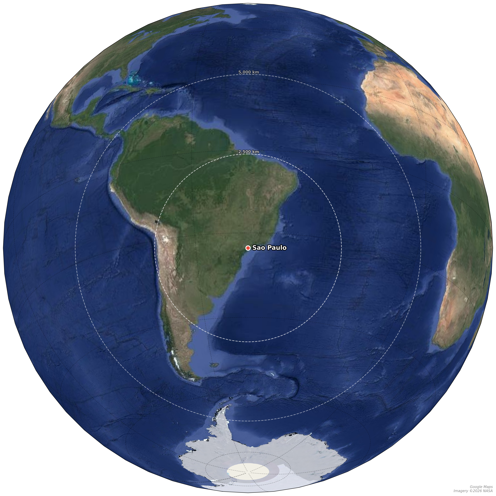
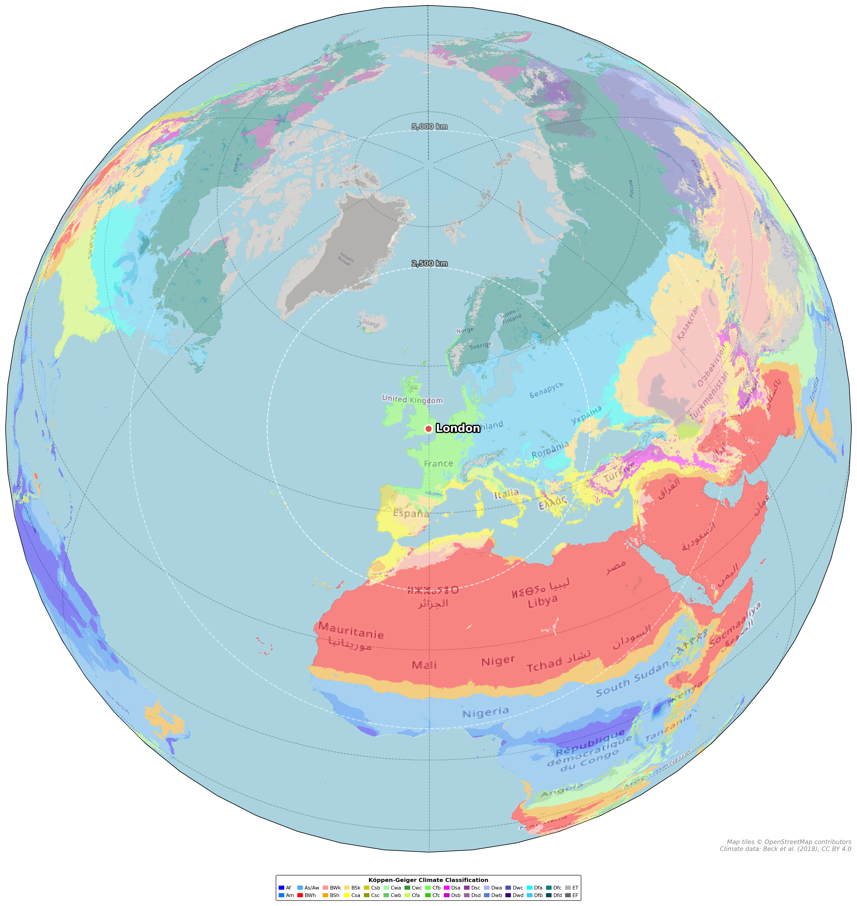

# Orthographic Map Generator

This project generates high-resolution orthographic globe images centered on a selected major city using Cartopy, Matplotlib, and online web map tiles.

The main script is [ortho.py](ortho.py).

## Sample Output

<p align="center">
  
  
</p>

*Left: Orthographic globe centred on São Paulo (Google Satellite, zoom 3) showing concentric geodesic distance circles.*<br>
*Right: Orthographic globe centred on London (OSM, zoom 3) featuring the Köppen-Geiger climate classification overlay.*

## Features

- Interactive city selection from a built-in list of major metropolitan areas
- Custom latitude/longitude input for arbitrary locations
- Orthographic globe projection centered on the chosen location
- Support for multiple tile providers
- High-resolution PNG export with transparent background
- Buffered tile fetching to reduce missing imagery near the edge of the globe
- Non-interactive CLI mode with `argparse` for scripting and automation
- City marker and label overlay on the globe for named locations
- Concentric geodesic distance circles (2,500 km and 5,000 km) drawn around the centre point with labelled radii
- Optional Köppen-Geiger climate classification overlay with compact legend
- Optional route overlays loaded from GeoJSON files, drawn as great-circle polylines
- Graceful error handling for network tile fetch failures
- Automatic attribution block crediting the tile provider and any datasets used

## Supported Cities

The script currently includes:

- NYC
- Moscow
- Shanghai
- London
- Paris
- Berlin
- Ankara
- New Delhi
- Tokyo
- Jakarta
- Manila
- Sao Paulo
- Lagos
- Johannesburg
- Sydney
- Lisbon
- Honolulu
- Papeete
- San Francisco

## Supported Tile Providers

The interactive menu exposes these providers:

- `osm`
- `google`
- `google_satellite`

## Requirements

- Python 3.14
- Internet access for downloading map tiles

Packages present in the local virtual environment include:

- `cartopy==0.25.0`
- `matplotlib==3.10.8`
- `numpy==2.4.3`
- `pyproj==3.7.2`
- `shapely==2.1.2`
- `scipy==1.17.1`
- `pillow==12.1.1`

## Setup

Install from the lock file:

```powershell
python -m venv .venv
.venv\Scripts\activate
pip install -r requirements.txt
```

Or install as an editable package (includes a console `ortho` command):

```powershell
pip install -e ".[dev]"
```

## Usage

### Interactive Mode

Run the script with no arguments to enter interactive mode:

```powershell
python ortho.py
```

You will be prompted to choose:

1. A location (pre-defined city **or** custom coordinates)
2. A tile provider
3. A zoom level
4. Optional Köppen-Geiger climate overlay and opacity/alpha (0–1)
5. An optional GeoJSON route file to overlay (leave blank to skip)

### CLI Mode

Pass arguments directly for non-interactive use:

```powershell
# Pre-defined city
python ortho.py --city NYC --provider google --zoom 3 --dpi 600

# Custom coordinates (Tokyo)
python ortho.py --lat 35.6762 --lon 139.6503 --provider osm --zoom 2

# Explicit output path
python ortho.py --city paris --provider osm --zoom 3 -o my_globe.png

# Save to a specific directory
python ortho.py --city london --provider google_satellite --zoom 2 --output-dir renders/

# Draw a route from a GeoJSON file (repeat --route for more)
python ortho.py --city lisbon --zoom 3 --route routes/gibraltar_ascension_falklands.geojson
```

#### CLI Flags

| Flag | Description | Default |
|---|---|---|
| `--city CITY` | Pre-defined city (case-insensitive) | — |
| `--lat LAT` | Custom latitude (-90 to 90) | — |
| `--lon LON` | Custom longitude (-180 to 180) | — |
| `--provider` | Tile provider: `osm`, `google`, `google_satellite` | `osm` |
| `--zoom ZOOM` | Tile zoom level (1–4) | `3` |
| `--dpi DPI` | Output resolution | `600` |
| `-o`, `--output` | Explicit output filepath (overrides auto-naming) | — |
| `--output-dir` | Directory for auto-named output files | `.` |
| `--cache-dir` | OSM tile cache directory (Google tiles are never cached) | `~/.cache/ortho_tiles` |
| `--no-cache` | Download OSM tiles fresh instead of using the cache | off |
| `--koppen` | Enable Köppen-Geiger climate classification overlay | off |
| `--koppen-alpha ALPHA` | Opacity of the climate overlay (0–1) | `0.45` |
| `--route GEOJSON` | GeoJSON route file to draw; repeat for multiple files | — |

> **Note:** `--city` and `--lat` are mutually exclusive. When using `--lat`, `--lon` is required.

### Output Naming

The script writes a PNG named like:

```text
orthographic_map_<city>_<provider>_z<zoom>.png
```

Example:

```text
orthographic_map_paris_osm_z5.png
```

## Programmatic Use

You can also import the generator directly:

```python
from ortho import generate_orthographic_map

generate_orthographic_map(
    lat=48.8566,
    lon=2.3522,
    output_filename="orthographic_map_paris_osm_z3.png",
    tile_provider="osm",
    zoom=3,
    dpi=600,
    output_dir="renders",  # optional: save to a specific directory
    city_name="Paris",     # optional: adds a marker and label on the map
    routes=None,           # optional: list of Route objects, see "Route Overlays"
)
```

## Testing

Run the test suite (requires the `[dev]` extra or `pip install pytest`):

```powershell
python -m pytest tests/ -v
```

## Notes

- Zoom is capped at level `4` to avoid excessive tile downloads. Lower zoom levels are safer for full-globe renders.
- Output uses `bbox_inches="tight"` and `transparent=True`, so the resulting PNG has minimal padding around the globe.
- Google tile backends depend on Cartopy tile services and may be subject to provider availability or usage limits.
- If tile fetching fails due to network issues, the map will still be saved with fallback land/ocean features.
- OSM tiles are cached in `~/.cache/ortho_tiles/osm/` and reused for 7 days, as the OSM tile usage policy asks. Use `--cache-dir` to change the location or `--no-cache` to skip it. Failed downloads are never cached. Google tiles are never cached, because Google's terms don't allow it. In code, pass `tile_cache_dir=configure_tile_cache()` to `generate_orthographic_map`; the default is no cache.
- When a pre-defined city is selected, a red marker and bold label are drawn at the centre point. Custom-coordinate renders omit the marker.
- Every render includes two concentric geodesic circles at 2,500 km and 5,000 km from the centre, computed on the WGS-84 ellipsoid. The circles are drawn as white dashed rings with distance labels at their northernmost point.

## Route Overlays

Pass one or more GeoJSON files with `--route` (CLI), at the interactive prompt,
or as `routes=` (API) to draw routes on the globe:

```powershell
python ortho.py --city lisbon --route routes/gibraltar_ascension_falklands.geojson
```

```python
from ortho import generate_orthographic_map
from routes import load_routes

generate_orthographic_map(
    lat=38.7223, lon=-9.1393, output_filename="lisbon.png",
    routes=load_routes("routes/gibraltar_ascension_falklands.geojson"),
)
```

Route files live in [routes/](routes/). Each file is a GeoJSON `FeatureCollection`,
`Feature` or bare geometry containing `LineString` or `MultiLineString` geometries.
Coordinates are `[lon, lat]` in degrees, and segments between vertices are drawn
along the great circle. Styling uses the
[simplestyle-spec](https://github.com/mapbox/simplestyle-spec) properties, so
files also render correctly on GitHub and [geojson.io](https://geojson.io):

| Property | Meaning | Default |
|---|---|---|
| `name` | Route name (used in logs) | file name |
| `stroke` | Line colour (any Matplotlib colour) | `#ff0000` |
| `stroke-width` | Line width in points | `2` |

```json
{
  "type": "Feature",
  "properties": {"name": "My route", "stroke": "#ff0000", "stroke-width": 2},
  "geometry": {"type": "LineString", "coordinates": [[-5.35, 36.14], [-14.36, -7.95]]}
}
```

Route files are validated before any tiles are fetched, so a missing or malformed
file fails immediately.

## Köppen-Geiger Climate Overlay

Pass `--koppen` (CLI) or `koppen=True` (API) to render a semi-transparent
Köppen-Geiger climate classification layer on top of the globe.

```powershell
python ortho.py --city paris --provider osm --zoom 3 --koppen
python ortho.py --city tokyo --provider google_satellite --zoom 3 --koppen --koppen-alpha 0.6
```

**Data:** the first `--koppen` run downloads the V1 archive
(`Beck_KG_V1.zip`, ~71 MB) from [Figshare](https://doi.org/10.6084/m9.figshare.6396959),
checks its MD5 and extracts the 0.083° present-day raster into
`~/.cache/ortho_tiles/koppen/`. Later runs reuse it. If you already have the
archive, extract it into a `Beck_KG_V1/` folder next to `koppen.py`, which is
checked first. If the data can't be obtained, the map is still rendered without
the overlay and a warning explains what to do.

The overlay uses the 30-class colour scheme from the official dataset and adds
a compact legend strip below the globe. The dataset credit
(*Climate data: Beck et al. (2018), CC BY 4.0*) is added to the attribution
block in the bottom-right corner of the image (see below).

## Data Sources & Licensing

| Data | Authors | License | Reference |
|---|---|---|---|
| Köppen-Geiger climate classification V1, present day (1980–2016), used at 0.083° (~10 km) | Beck, H. E. et al. (2018) | [CC BY 4.0](https://creativecommons.org/licenses/by/4.0/) | [doi:10.1038/sdata.2018.214](https://doi.org/10.1038/sdata.2018.214) |
| Natural Earth (land / ocean fallback) | Natural Earth contributors | Public domain | [naturalearthdata.com](https://www.naturalearthdata.com/) |
| OpenStreetMap tiles | OpenStreetMap contributors | Data [ODbL](https://www.openstreetmap.org/copyright); attribution required by the [tile usage policy](https://operations.osmfoundation.org/policies/tiles/) | [openstreetmap.org](https://www.openstreetmap.org/) |
| Google map / satellite tiles (Map Tiles API, API key required) | Google | Proprietary, [Google Maps terms](https://cloud.google.com/maps-platform/terms) | [google.com/maps](https://www.google.com/maps) |

Every render carries an attribution block in its bottom-right corner, outside
the globe:

| Layer | Credit line |
|---|---|
| `osm` tiles | *Map tiles © OpenStreetMap contributors* |
| `google`, `google_satellite` tiles | *Google Maps* plus the copyright string returned by the Map Tiles API |
| `--koppen` overlay | *Climate data: Beck et al. (2018), CC BY 4.0* |

Keep this block (or credit the same sources elsewhere) when you share or publish
a map; the OSM tile policy and the CC BY 4.0 licence both require it.

### Google tiles (API key required)

The `google` and `google_satellite` providers use the official
[Map Tiles API](https://developers.google.com/maps/documentation/tile/2d-tiles-overview).
Enable the Map Tiles API (with billing) in a Google Cloud project and create an
API key whose API restrictions allow the Map Tiles API.

The key is read from `GOOGLE_MAPS_API_KEY`, or from `GOOGLE_API_KEY` if that is
not set. Like newsgrab, the CLI loads keys from a central file before reading the
environment, without overriding variables that are already set:

1. `$ORTHO_ENV_FILE` (explicit override)
2. `~/myapikeys.env` (central key file shared with newsgrab)
3. `./.env`

So the simplest setup is one line in `~/myapikeys.env`:

```text
GOOGLE_MAPS_API_KEY=your-key
```

```powershell
python ortho.py --city tokyo --provider google_satellite
```

A Gemini key from AI Studio (`GOOGLE_API_KEY`) is usually restricted to the
Gemini API, and Google answers with HTTP 403 "Requests to this API … are
blocked". Use a separate Maps key in `GOOGLE_MAPS_API_KEY`, or add the Map Tiles
API to that key's allowed APIs.

Interactive mode asks for the key (input hidden) if neither variable is set.
Google renders are credited with "Google Maps" plus the copyright string the
API returns for the map. Google's policies also restrict caching and some uses
of exported imagery; check the Map Tiles API policies before publishing.

## Project Files

- [ortho.py](ortho.py): main script and reusable map-generation functions
- [koppen.py](koppen.py): Köppen-Geiger climate overlay and legend
- [routes.py](routes.py): GeoJSON route loading and drawing
- [routes/](routes/): bundled route files
- [requirements.txt](requirements.txt): pinned dependencies
- [pyproject.toml](pyproject.toml): project metadata and `console_scripts` entry point
- [tests/](tests/): unit test suite
