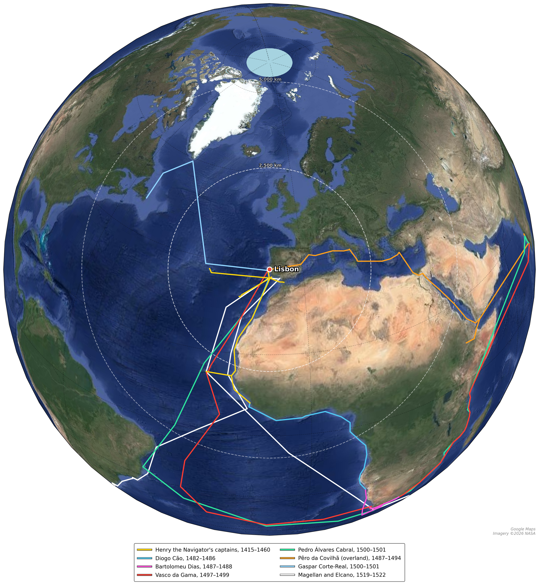
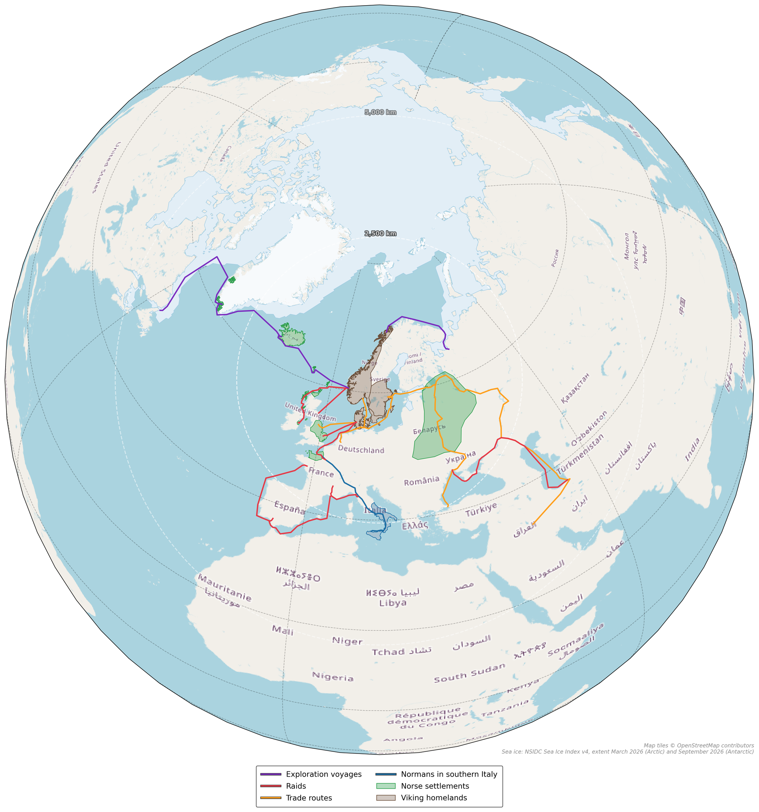
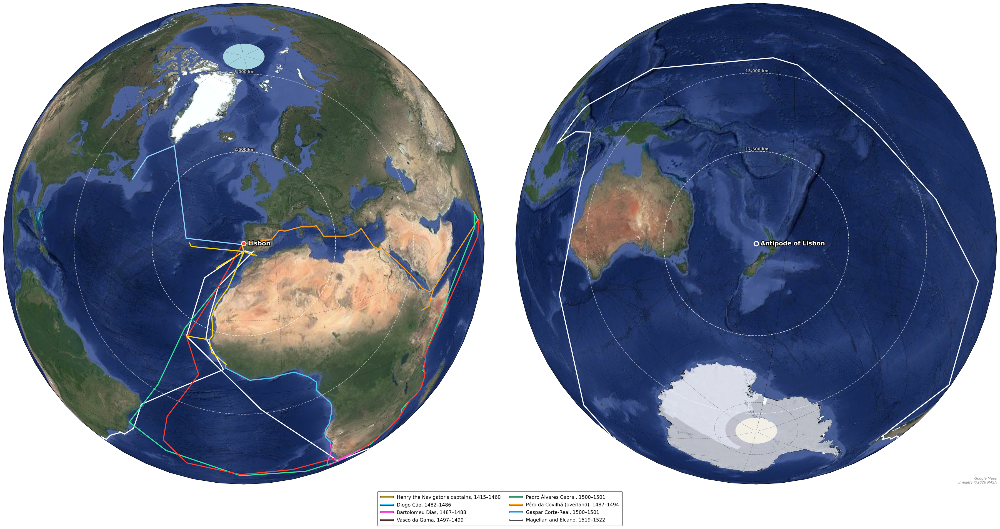
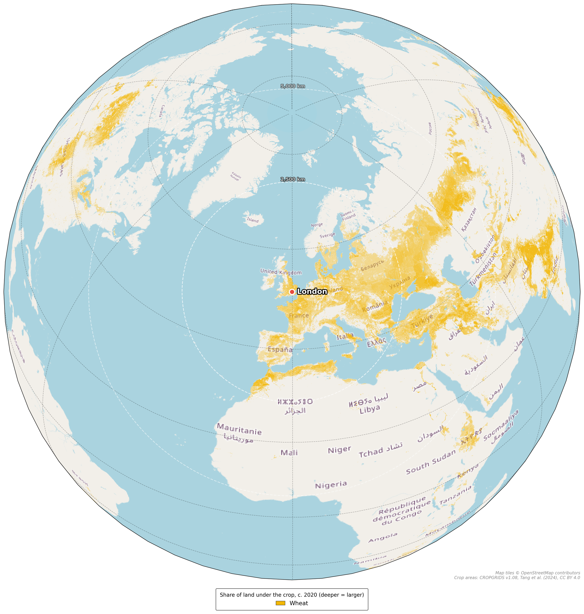
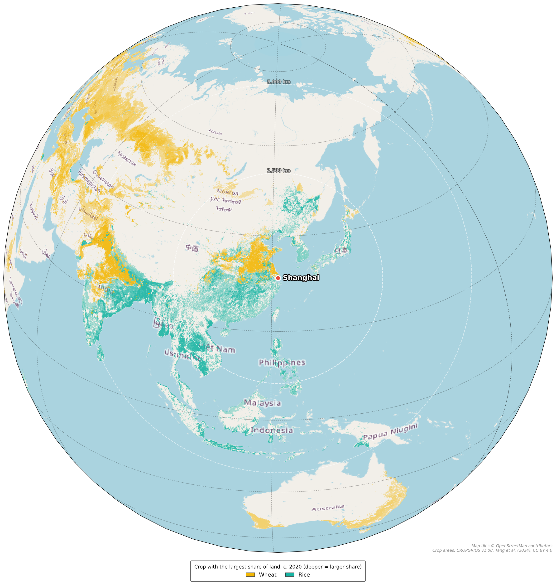
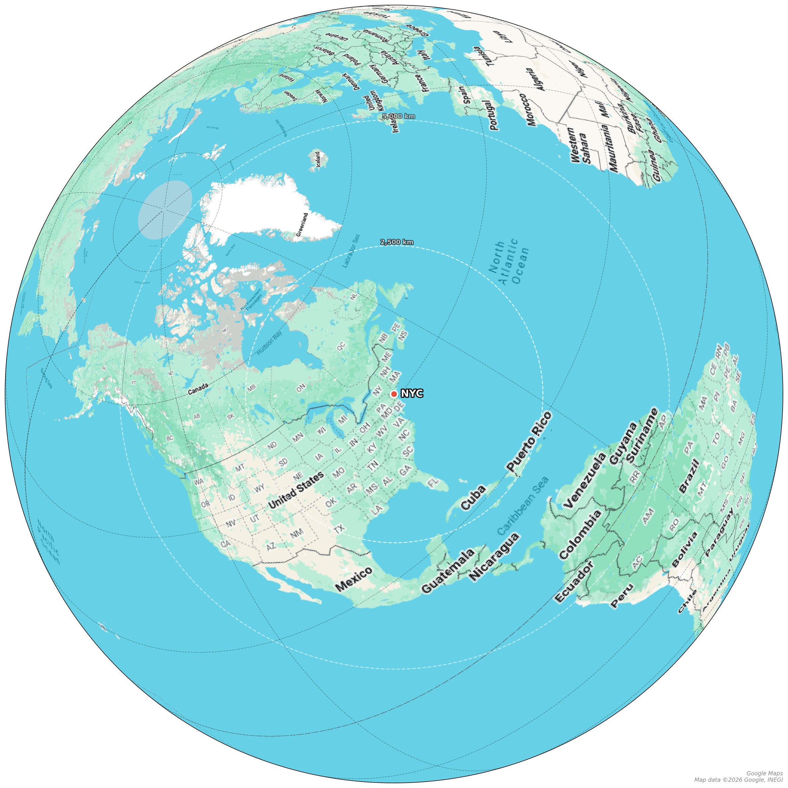
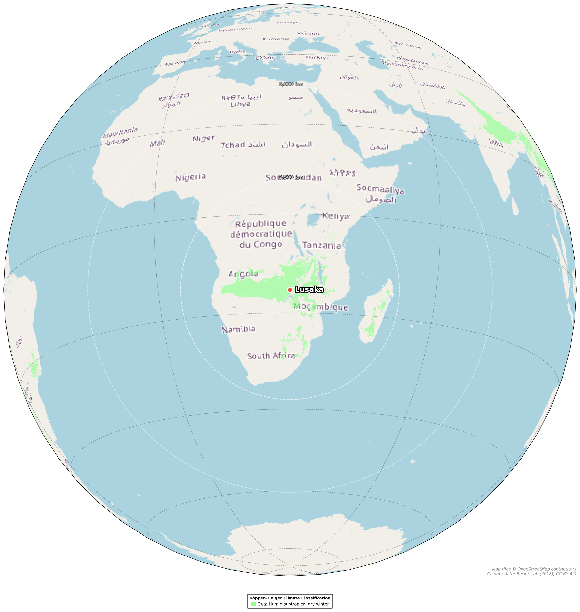

# Orthographic Map Generator

This project generates high-resolution orthographic globe images centered on a selected major city using Cartopy, Matplotlib, and online web map tiles.

The main script is [ortho.py](ortho.py).

## Sample Output

<p align="center">
  
  
</p>

*Left: Orthographic globe centred on São Paulo (Google Satellite, zoom 3) showing concentric geodesic distance circles.*<br>
*Right: Orthographic globe centred on London (OSM, zoom 3) featuring the Köppen-Geiger climate classification overlay.*

<p align="center">
  
  
</p>

*Left: The Portuguese voyages of discovery, 1415–1522, centred on Lisbon (Google Satellite, zoom 3) with a route key.*<br>
*Right: Viking Age homelands, settlements, trade, raids and exploration, centred on Scandinavia (OSM, zoom 3) with a route key and polar ice at its winter maximum.*

<p align="center">
  
</p>

*Both hemispheres: Lisbon's globe and, beside it, the globe centred on its antipode in the Tasman Sea, which shows Magellan's Pacific crossing and Elcano's return across the Indian Ocean (Google Satellite, zoom 3).*

<p align="center">
  
  
</p>

*Left: Where wheat is grown, centred on London (OSM, zoom 3), c. 2020.*<br>
*Right: Wheat or rice, whichever covers more land in each place, centred on Shanghai (OSM, zoom 3): the wheat–rice divide in China and India.*

<p align="center">
  
  
</p>

*Left: Centred on New York and turned so London's direction (bearing 51°) is up (NASA Blue Marble, zoom 3).*<br>
*Right: Only Cwa, humid subtropical with dry winters, which covers 71% of Zambia, centred on Lusaka (OSM, zoom 3).*

## Features

- Interactive city selection from a built-in list of major metropolitan areas
- Custom latitude/longitude input for arbitrary locations
- Orthographic globe projection centered on the chosen location
- Support for multiple tile providers, including free NASA Blue Marble satellite imagery with no API key
- High-resolution PNG export with transparent background
- Buffered tile fetching to reduce missing imagery near the edge of the globe
- Non-interactive CLI mode with `argparse` for scripting and automation, its options grouped by topic in `--help`
- Recipe files (`--config`): a map's settings in a small TOML file, one per sample map in [recipes/](recipes/)
- City marker and label overlay on the globe for named locations
- Concentric geodesic distance circles (2,500 km and 5,000 km) drawn around the centre point with labelled radii
- Optional second globe centred on the antipode, so one image shows the whole Earth
- Optional Köppen-Geiger climate classification overlay with compact legend, for all classes or only chosen ones
- Optional polar ice: sea ice at its latest winter maximum (NSIDC) and permanent polar land ice
- Optional crop areas for any of 173 crops (CROPGRIDS), one or several at once, with a key
- Any compass direction at the top of the globe (south up, or the direction toward a place), with text kept upright
- Optional route overlays loaded from GeoJSON files, drawn as great-circle polylines and translucent filled areas
- Optional route key below the globe, with short labels and grouping set in the GeoJSON
- Bundled historical route sets: the Portuguese voyages of discovery and the Viking Age
- Graceful error handling for network tile fetch failures
- Automatic attribution block crediting the tile provider and any datasets used

## Supported Cities

The script currently includes:

- NYC
- Moscow
- Shanghai
- London
- Paris
- Berlin
- Ankara
- New Delhi
- Tokyo
- Jakarta
- Manila
- Sao Paulo
- Lagos
- Johannesburg
- Lusaka
- Sydney
- Lisbon
- Honolulu
- Papeete
- San Francisco

## Supported Tile Providers

The interactive menu exposes these providers:

- `osm`: OpenStreetMap
- `google`: Google road map (API key required)
- `google_satellite`: Google satellite imagery (API key required; not available to EEA-billed projects, see below)
- `nasa`: NASA Blue Marble satellite imagery with shaded relief and ocean-floor bathymetry; free, public domain, no key

`nasa` is the free satellite option. It comes from NASA's Global Imagery Browse
Services (GIBS): the Blue Marble: Next Generation true-colour land composite
(2004, 500 m per pixel) over shaded relief and bathymetry, in Web Mercator up to
zoom 8, far more than a globe needs. It needs no account or key, has no regional
limits, and is cached like OSM (for a year, since the imagery never changes).
Like Google satellite, it has no place names baked in, so it suits turned globes.

## Requirements

- Python 3.12 or newer (developed on 3.14)
- Internet access for downloading map tiles (and, once each, the Köppen, sea ice and crop data)

`requirements.txt` lists minimum versions, not pins. The versions this was developed and tested with:

- `cartopy==0.25.0`
- `matplotlib==3.10.8`
- `numpy==2.4.3`
- `pyproj==3.7.2`
- `shapely==2.1.2`
- `scipy==1.17.1`
- `pillow==12.1.1`
- `python-dotenv==1.2.4`
- `h5py==3.16.0`

## Setup

Install the dependencies:

```powershell
python -m venv .venv
.venv\Scripts\activate
pip install -r requirements.txt
```

Or install as an editable package (includes a console `ortho` command):

```powershell
pip install -e ".[dev]"
```

## Usage

### Interactive Mode

Run the script with no arguments to enter interactive mode:

```powershell
python ortho.py
```

You will be prompted to choose:

1. A location (pre-defined city **or** custom coordinates)
2. A tile provider
3. A zoom level
4. Whether to also draw the opposite hemisphere (see "Both Hemispheres")
5. The compass bearing to put at the top (blank keeps north up; see "Turning the Globe")
6. Optional Köppen-Geiger climate overlay, its opacity/alpha (0–1) and the classes to show (blank for all)
7. Whether to add polar ice at its winter maximum (see "Polar Ice")
8. Crops to shade, comma-separated, e.g. `wheat, rice` (blank to skip, `?` to list them; see "Crop Areas")
9. An optional GeoJSON route file to overlay (leave blank to skip)
10. Whether to add a key naming each route (asked only when a route file is loaded)

### CLI Mode

Pass arguments directly for non-interactive use:

```powershell
# Pre-defined city
python ortho.py --city NYC --provider google --zoom 3 --dpi 600

# Custom coordinates (Tokyo)
python ortho.py --lat 35.6762 --lon 139.6503 --provider osm --zoom 2

# Explicit output path
python ortho.py --city paris --provider osm --zoom 3 -o my_globe.png

# Save to a specific directory
python ortho.py --city london --provider google_satellite --zoom 2 --output-dir renders/

# Draw a route from a GeoJSON file (repeat --route for more)
python ortho.py --city lisbon --zoom 3 --route routes/gibraltar_ascension_falklands.geojson

# A route file with a key naming each route (see "Route Overlays")
python ortho.py --city lisbon --provider google_satellite --route routes/portuguese_explorers.geojson --route-legend

# The whole Earth: Shanghai's globe and its antipode side by side (see "Both Hemispheres")
python ortho.py --city shanghai --both-hemispheres

# Polar ice at its latest winter maximum, or at a chosen year's (see "Polar Ice")
python ortho.py --city moscow --ice
python ortho.py --lat 90 --lon 0 --ice-year 2012

# Where wheat is grown; several crops show the largest one in each place (see "Crop Areas")
python ortho.py --lat 45 --lon 40 --crop wheat
python ortho.py --lat 30 --lon 95 --crop wheat --crop rice --crop maize

# Only some climate classes: oceanic climates, or every Mediterranean one (see "Köppen-Geiger Climate Overlay")
python ortho.py --city london --koppen-class Cfb --koppen-alpha 0.7
python ortho.py --lat 30 --lon 0 --koppen-class Cs --both-hemispheres

# South up, or the direction toward a place at the top (see "Turning the Globe")
python ortho.py --city sydney --up 180
python ortho.py --city lisbon --provider google_satellite --up-toward "New Delhi"
```

#### CLI Flags

| Flag | Description | Default |
|---|---|---|
| `--city CITY` | Pre-defined city (case-insensitive) | — |
| `--lat LAT` | Custom latitude (-90 to 90) | — |
| `--lon LON` | Custom longitude (-180 to 180) | — |
| `--provider` | Tile provider: `osm`, `google`, `google_satellite`, `nasa` | `osm` |
| `--zoom ZOOM` | Tile zoom level (1–4) | `3` |
| `--dpi DPI` | Output resolution, 10–1200. The figure is 20 in, so 300 DPI = 6,000 px | `300` |
| `-o`, `--output` | Explicit output filepath (overrides auto-naming) | — |
| `--output-dir` | Directory for auto-named output files | `.` |
| `--cache-dir` | OSM and NASA tile cache directory (Google tiles are never cached) | `~/.cache/ortho_tiles` |
| `--no-cache` | Download OSM and NASA tiles fresh instead of using the cache | off |
| `--koppen` | Enable Köppen-Geiger climate classification overlay | off |
| `--koppen-alpha ALPHA` | Opacity of the climate overlay (0–1) | `0.45` |
| `--koppen-class CLASS` | Show only this climate class (`Cfb`) or group (`C`, `Cs`); repeat for several; implies `--koppen` | all |
| `--ice` | Draw sea ice at its winter maximum and polar land ice | off |
| `--ice-year YEAR` | Year of the sea ice maxima, 1979 on; implies `--ice` | latest published |
| `--crop NAME[:COLOUR]` | Shade where a crop is grown; repeat for several crops | — |
| `--list-crops` | List the 173 crop names `--crop` accepts, then exit | — |
| `--route GEOJSON` | GeoJSON route file to draw; repeat for multiple files | — |
| `--route-legend` | Add a key below the globe naming each route next to its colour | off |
| `--both-hemispheres` | Draw a second globe centred on the antipode, showing the whole Earth; `--dpi` up to 600 | off |
| `--up BEARING` | Compass bearing to put at the top, in degrees clockwise from north | `0` |
| `--up-toward PLACE` | Put the direction toward a city or `LAT,LON` at the top (instead of `--up`) | — |
| `--config FILE` | Read settings from a TOML recipe file; the command line overrides it (see "Recipe Files") | — |

> **Note:** `--city` and `--lat` are mutually exclusive. When using `--lat`, `--lon` is required.

`python ortho.py --help` lists the options in the same groups: Location, Imagery
and output, Globe layout, Climate, Polar ice, Crops, Routes and areas, Recipes.

### Recipe Files

A recipe is a small TOML file holding a map's settings, so a long command becomes
`python ortho.py --config recipes/viking_routes.toml`. Its keys are the option
names without the dashes (`route-legend` or `route_legend`); a list repeats an
option and `true` turns a flag on:

```toml
# recipes/viking_routes.toml
lat = 62
lon = 15
provider = "osm"
route = [
    "../routes/viking_homelands.geojson",
    "../routes/viking_trade.geojson",
]
route-legend = true
ice = true
output = "orthographic_map_scandinavia_osm_z3_vikings_ice.png"
```

- **The command line wins.** Options typed after `--config` override the recipe:
  `--config recipes/viking_routes.toml --provider nasa --dpi 600`. Repeatable
  options (`--route`, `--crop`, `--koppen-class`) add to the recipe's list.
  Giving `--city` or `--lat`/`--lon` replaces the recipe's location, and `--up`
  or `--up-toward` replaces its orientation, so a recipe works anywhere:
  `--config recipes/london_wheat.toml --city lusaka -o lusaka_wheat.png`. (The
  bundled recipes name their output file, so give `-o` when you change the place.)
- **Paths.** Route files in a recipe are relative to the recipe file, so recipes
  run from any folder. Output paths (`output`, `output-dir`) are relative to
  where you run the command, as on the command line.
- **Checks.** Recipe values go through the same checks as typed options (allowed
  providers, zoom range, crop and climate names, …). An unknown key stops with a
  suggestion (`citty` → "Did you mean 'city'?"). `config` and `list-crops` can't
  be set in a recipe.
- A `false` flag simply leaves it off; to turn off a flag a recipe sets, edit the
  recipe.

[recipes/](recipes/) has one recipe per sample map in this README:

| Recipe | Sample |
|---|---|
| `sao_paulo.toml` | São Paulo on Google satellite imagery, with distance rings |
| `london_koppen.toml` | London with the Köppen-Geiger climate overlay |
| `portuguese_voyages.toml` | The Portuguese voyages of discovery, with a key |
| `portuguese_hemispheres.toml` | The Portuguese voyages on both hemispheres |
| `viking_routes.toml` | The Viking Age, with polar ice |
| `london_wheat.toml` | Where wheat is grown, centred on London |
| `shanghai_wheat_rice.toml` | Wheat or rice, centred on Shanghai |
| `nyc_toward_london.toml` | New York turned toward London, NASA imagery |
| `lusaka_cwa.toml` | Zambia's dominant climate, Cwa |

The Google satellite recipes need a Google Maps key and are affected by Google's
EEA restriction (see "Google tiles" below); add `--provider nasa` to render them
with free satellite imagery instead.

### Output Naming

The script writes a PNG named like:

```text
orthographic_map_<city>_<provider>_z<zoom>.png
```

Example:

```text
orthographic_map_paris_osm_z3.png
```

## Programmatic Use

You can also import the generator directly:

```python
from ortho import generate_orthographic_map

generate_orthographic_map(
    lat=48.8566,
    lon=2.3522,
    output_filename="orthographic_map_paris_osm_z3.png",
    tile_provider="osm",
    zoom=3,
    dpi=300,
    output_dir="renders",  # optional: save to a specific directory
    city_name="Paris",     # optional: adds a marker and label on the map
    routes=None,           # optional: list of Route objects, see "Route Overlays"
    route_legend=False,    # optional: add a key naming each route
    both_hemispheres=False,  # optional: add a globe centred on the antipode
    ice=False,             # optional: polar ice at its winter maximum
    crops=None,            # optional: e.g. ["wheat", "rice:#18b5a4"]
    koppen_classes=None,   # optional: e.g. ["Cfb"] or ["Cs"]; implies koppen=True
    up=0,                  # optional: compass bearing at the top (180 = south up)
)
```

## Testing

Run the test suite (requires the `[dev]` extra or `pip install pytest`):

```powershell
python -m pytest
```

The suite runs fully offline. `tests/conftest.py` blocks any connection to a non-local host, points Cartopy at an empty data folder, and replaces the Natural Earth land/ocean features with small stand-ins, so a test that accidentally reaches the network fails instead of quietly passing on an online machine.

## Notes

- Zoom is capped at level `4` to avoid excessive tile downloads. Lower zoom levels are safer for full-globe renders.
- Web map tiles stop at about ±85° latitude, so a small disc around each pole shows the plain fallback colours. On OSM they match the tiles and are hard to see; on `google_satellite` and `nasa` the disc is visible. `--ice` covers both discs with ice; without it this is a known cosmetic limitation.
- The default 300 DPI gives a ~6,000 px image. Map imagery carries roughly 2,000–4,000 px of real detail at zoom 3–4, so higher DPIs mostly upscale it; they still make text, circles, routes and the keys sharper (`--dpi 600` gives ~12,000 px).
- Output uses `bbox_inches="tight"` and `transparent=True`, so the resulting PNG has minimal padding around the globe.
- Google tile backends depend on Cartopy tile services and may be subject to provider availability or usage limits.
- If some or all map tiles fail to download, the map is still saved: missing tiles are left transparent so the fallback land/ocean features show through, and a warning says how many tiles failed.
- OSM tiles are cached in `~/.cache/ortho_tiles/osm/` and reused for 7 days, as the OSM tile usage policy asks; NASA tiles are cached in `~/.cache/ortho_tiles/nasa/` for a year. Use `--cache-dir` to change the location or `--no-cache` to skip it. Failed downloads are never cached. Google tiles are never cached, because Google's terms don't allow it. In code, pass `tile_cache_dir=configure_tile_cache()` to `generate_orthographic_map`; the default is no cache.
- When a pre-defined city is selected, a red marker and bold label are drawn at the centre point. Custom-coordinate renders omit the marker.
- Every render includes two concentric geodesic circles at 2,500 km and 5,000 km from the centre, computed on the WGS-84 ellipsoid. The circles are drawn as white dashed rings with distance labels at the top of each circle as drawn on the globe.

## Turning the Globe

By default north is up. `--up BEARING` (`up=` in the API, or the interactive
prompt) turns the globe so another compass direction points up, measured in
degrees clockwise from north: `--up 180` gives a south-up map, `--up 90` puts
east at the top. `--up-toward PLACE` works out the bearing for you, so the
direction toward a city or a `LAT,LON` point is at the top, along the great
circle:

```powershell
python ortho.py --city sydney --up 180
python ortho.py --city lisbon --provider google_satellite --up-toward "New Delhi"
python ortho.py --city london --up-toward 21.42,39.83    # Mecca: the qibla, 119°
```

The New York sample above was rendered with
`python ortho.py --config recipes/nyc_toward_london.toml`
(`--city nyc --provider nasa --up-toward london`).

- The globe turns; the text does not. The city label, distance-ring labels,
  keys and credits stay upright, and the ring labels stay at the top of their
  rings. Tiles, routes, areas, ice, crops and climate colours turn with the globe.
- Place names that are part of the OSM or Google road-map tiles are baked into
  the imagery, so they turn with it and read sideways or upside down. Satellite
  imagery (`nasa`, `google_satellite`) has none, which makes it the best fit for
  turned globes.
- With `--both-hemispheres` the far globe turns to match: the point at the top
  of the near globe is also at the top of the far one, so the pair stays two
  halves of one Earth.
- Turned globes are computed on a sphere of the Earth's mean radius rather than
  the WGS-84 ellipsoid, a difference far below a pixel at globe scale. North-up
  renders are unchanged.
- Auto-named files get an `_up<bearing>` suffix, for example
  `orthographic_map_sydney_osm_z3_up180.png`.
- For a point with a negative latitude, join the value with `=` so it isn't
  read as another option: `--up-toward=-33.9,151.2`.

## Both Hemispheres

An orthographic globe shows one hemisphere. `--both-hemispheres`
(`both_hemispheres=True` in the API, or the interactive prompt) adds a second
globe to the right, centred on the antipode: the point directly opposite the
centre, at the negated latitude and 180° of longitude away. Together the two
globes show the whole Earth, the way old atlases drew the world as a pair of
hemispheres.

```powershell
python ortho.py --city lisbon --provider google_satellite --route routes/portuguese_explorers.geojson --route-legend --both-hemispheres
```

- The far globe marks the antipode with a hollow ring ("Antipode of Lisbon").
- Its distance circles are still measured from the chosen city, at 15,000 and
  17,500 km, which mirrors the 5,000 and 2,500 km rings on the near globe.
- Routes, areas and the Köppen-Geiger overlay are drawn on both globes, so a
  route that goes over the horizon of one carries on in the other. Each key is
  drawn once, centred under the pair, and the credits sit under the right globe.
- Auto-named files get a `_hemispheres` suffix, for example
  `orthographic_map_lisbon_google_satellite_z3_hemispheres.png`.
- The image is twice as wide (about 9,600 px at 300 DPI), so `--dpi` is
  capped at 600 instead of 1,200 to keep the same memory budget. Google
  renders download tiles for both globes.

## Route Overlays

Pass one or more GeoJSON files with `--route` (CLI), at the interactive prompt,
or as `routes=` (API) to draw routes and areas on the globe. Add `--route-legend`
for a key naming each one:

```powershell
python ortho.py --city lisbon --route routes/gibraltar_ascension_falklands.geojson
python ortho.py --city lisbon --route routes/portuguese_explorers.geojson --route-legend
```

```python
from ortho import generate_orthographic_map
from routes import load_routes

generate_orthographic_map(
    lat=38.7223, lon=-9.1393, output_filename="lisbon.png",
    routes=load_routes("routes/portuguese_explorers.geojson"),
    route_legend=True,
)
```

Files given later are drawn on top of earlier ones. Route files are validated
before any tiles are fetched, so a missing or malformed file fails immediately.

### File format

Each file is a GeoJSON `FeatureCollection`, `Feature` or bare geometry with
`[lon, lat]` coordinates in degrees:

- `LineString` and `MultiLineString` are drawn as lines. Segments between
  vertices follow the great circle, so sparse routes still curve correctly.
- `Polygon` and `MultiPolygon` are drawn as translucent filled areas beneath
  the lines. Holes are supported.

Styling uses the [simplestyle-spec](https://github.com/mapbox/simplestyle-spec)
property names, so files also render sensibly on GitHub and
[geojson.io](https://geojson.io):

| Property | Meaning | Default |
|---|---|---|
| `name` | Route name, used in logs and as the key label | file name |
| `legend` | Short label for the route key; features with the same label share one entry | `name` |
| `stroke` | Line or outline colour (any Matplotlib colour) | `#ff0000` |
| `stroke-width` | Line or outline width in points | `2` |
| `fill` | Area fill colour (polygons only) | the `stroke` colour |
| `fill-opacity` | Area fill opacity, 0–1 (polygons only) | `0.35` |

```json
{
  "type": "Feature",
  "properties": {"name": "Vasco da Gama: sea route to India", "legend": "Vasco da Gama, 1497–1499",
                 "stroke": "#ff3b30", "stroke-width": 2.5},
  "geometry": {"type": "LineString", "coordinates": [[-9.14, 38.71], [-9.6, 38.5], [-15.97, 28.3]]}
}
```

### Route key

With `--route-legend` (`route_legend=True` in the API), a key below the globe
lists each label next to a swatch: a line for routes, a filled box for areas.
Entries run top layer first, the reverse of drawing order, as in a GIS layer
list. Give features a shared `legend` label to group them, for example all
trade routes as "Trade routes"; without one, every feature gets its own entry.
When the Köppen-Geiger overlay is on, the route key goes below the climate key.

### Bundled route files

| File | Colour | Contents |
|---|---|---|
| `gibraltar_ascension_falklands.geojson` | red | Gibraltar to Ascension Island and the Falklands |
| `portuguese_explorers.geojson` | one per voyage | Henry the Navigator's captains, Diogo Cão, Bartolomeu Dias, Vasco da Gama, Pedro Álvares Cabral, Pêro da Covilhã, Gaspar Corte-Real, and Magellan and Elcano (1415–1522) |
| `viking_homelands.geojson` | brown | Viking Age Denmark, Norway, and the Swedes and Geats |
| `viking_settlements.geojson` | green, blue | Norse settlements (Danelaw, Dublin, Norse Scotland and Man, Faroes, Iceland, Greenland, Normandy, Kievan Rus') in green; the Normans in southern Italy and Sicily in blue |
| `viking_trade.geojson` | orange | Dnieper and Volga river routes, Baltic and North Sea trade |
| `viking_raids.geojson` | red | Lindisfarne, Iona and Dublin, Paris, Iberia and the Mediterranean, East Anglia, the Caspian |
| `viking_exploration.geojson` | purple | Faroes, Iceland and Greenland, Vinland, Ohthere's White Sea voyage |

The Portuguese and Viking files carry `legend` labels, so they make compact keys.
The three historical sample maps above were rendered with these recipes (see
"Recipe Files"):

```powershell
python ortho.py --config recipes/portuguese_voyages.toml
python ortho.py --config recipes/viking_routes.toml
python ortho.py --config recipes/portuguese_hemispheres.toml
```

The Viking recipe, for example, stands for
`--lat 62 --lon 15 --route routes/viking_homelands.geojson --route routes/viking_settlements.geojson --route routes/viking_trade.geojson --route routes/viking_raids.geojson --route routes/viking_exploration.geojson --route-legend --ice`.

The ice on the Viking map is today's winter maximum, not the Viking Age's.

The routes are approximate, drawn through documented landfalls and checked so
that sea legs stay off land. The homeland and settlement areas are approximate
outlines clipped to the [Natural Earth](https://www.naturalearthdata.com/)
1:10m coastline (public domain).

## Polar Ice

`--ice` (`ice=True` in the API, or the interactive prompt) draws the ice at both
poles as it stands at the end of winter:

- **Sea ice at its winter maximum.** The Arctic usually peaks in March and the
  Antarctic in September, so the overlay uses NSIDC's monthly extent for those
  months: the area where at least 15% of the sea surface is ice. By default it
  uses the latest published maximum of each (the credit line names the months
  shown); `--ice-year 2012` picks a year instead, back to 1979.
- **Permanent land ice.** The Greenland and Antarctic ice sheets, the Antarctic
  ice shelves and the Arctic ice caps, from Natural Earth.

```powershell
python ortho.py --city lisbon --provider google_satellite --both-hemispheres --ice
```

Both fills are opaque, sea ice a shade bluer than land ice, so they also cover
the plain disc the map tiles leave around each pole. The sea ice outline follows
NSIDC's 25 km grid, smoothed slightly. The extent files are small (under 100 KB)
and are cached in `~/.cache/ortho_tiles/sea_ice/`; offline, the newest cached
year is used. If no data can be had, the map is saved without the ice and a
warning says why.

## Crop Areas

`--crop NAME` (`crops=[...]` in the API, or the interactive prompt) shades where
a crop is grown, from [CROPGRIDS](https://doi.org/10.1038/s41597-024-03247-7):
173 crops circa 2020 on a 0.05° (~5.6 km) grid. Each place is shaded by the
share of its land planted with the crop, from clear (under 0.5%) to the full
colour (40% or more). A key below the globe names the crop.

```powershell
python ortho.py --lat 45 --lon 40 --crop wheat
python ortho.py --lat 30 --lon 95 --crop wheat --crop rice --crop maize
python ortho.py --list-crops
```

The two crop samples above were rendered with:

```powershell
python ortho.py --config recipes/london_wheat.toml          # --city london --crop wheat
python ortho.py --config recipes/shanghai_wheat_rice.toml   # --city shanghai --crop wheat --crop rice
```

- **Several crops.** Repeat `--crop`. Each place then takes the colour of
  whichever of the chosen crops covers the most of it, shaded by that crop's
  share. Wheat, rice and maize over Asia show the north–south wheat–rice divide
  in China and India, and the maize belt of north-east China.
- **Names.** `--list-crops` prints all 173. They follow the dataset's file names:
  `sugarcane`, `oilpalm`, `sweetpotato`; "nes" means not elsewhere specified,
  "for" a fodder crop. A misspelt name stops before anything is downloaded, with
  suggestions (`whaet` → "Did you mean wheat?").
- **Colours.** Common crops have their own (wheat gold, rice teal, maize orange,
  coffee brown, …), others get distinct colours in turn. Choose one with
  `NAME:COLOUR`, e.g. `--crop rice:#00a0ff`.
- **Data.** All 173 crops ship in one 807 MB archive, so each crop's file (a few
  MB) is read straight out of it with HTTP range requests and cached in
  `~/.cache/ortho_tiles/cropgrids/`. Reading the files needs `h5py`.
- **Layering.** Crops are drawn over the Köppen-Geiger colours and under polar
  ice, routes and areas. Their key sits below the climate key, above the route
  key.
- **Accuracy.** CROPGRIDS rates each cell's data quality; major crops in countries
  with detailed statistics are mapped best, minor crops in data-poor regions are
  more estimated. At globe scale the patterns hold.

## Köppen-Geiger Climate Overlay

Pass `--koppen` (CLI) or `koppen=True` (API) to render a semi-transparent
Köppen-Geiger climate classification layer on top of the globe.

```powershell
python ortho.py --city paris --provider osm --zoom 3 --koppen
python ortho.py --city tokyo --provider google_satellite --zoom 3 --koppen --koppen-alpha 0.6
```

**Data:** the first `--koppen` run downloads the V1 archive
(`Beck_KG_V1.zip`, ~71 MB) from [Figshare](https://doi.org/10.6084/m9.figshare.6396959),
checks its MD5 and extracts the 0.083° present-day raster into
`~/.cache/ortho_tiles/koppen/`. Later runs reuse it. If you already have the
archive, extract it into a `Beck_KG_V1/` folder next to `koppen.py`, which is
checked first. If the data can't be obtained, the map is still rendered without
the overlay and a warning explains what to do.

The overlay uses the 30-class colour scheme from the official dataset and adds
a compact legend strip below the globe.

**Only some classes.** `--koppen-class` (`koppen_classes=` in the API, or the
interactive prompt) shows only the classes named and leaves everything else
clear; it turns `--koppen` on by itself. Give a class (`Cfb`), or the start of
one to take a whole group: `C` is every temperate class, `Cs` the three
Mediterranean ones, `BW` both deserts. Repeat it for several; names ignore case.
With eight classes or fewer the key also names them (*Cfb: Oceanic*). A single
class reads better with a stronger overlay, for example `--koppen-alpha 0.7`.

```powershell
python ortho.py --city london --koppen-class Cfb --koppen-alpha 0.7
python ortho.py --lat 30 --lon 0 --koppen-class Cs --both-hemispheres
```

The Lusaka sample above shows Zambia's dominant climate, Cwa (71% of the
country; then savanna, Aw, 19%; highland Cwb, 6%; hot semi-arid BSh, 3%):
`python ortho.py --config recipes/lusaka_cwa.toml`
(`--city lusaka --koppen-class Cwa --koppen-alpha 0.7`).

The classes are Af, Am, As/Aw (tropical); BWh, BWk, BSh, BSk (arid); Csa, Csb,
Csc, Cwa, Cwb, Cwc, Cfa, Cfb, Cfc (temperate); Dsa–Dsd, Dwa–Dwd, Dfa–Dfd
(continental); ET, EF (polar). The dataset credit
(*Climate data: Beck et al. (2018), CC BY 4.0*) is added to the attribution
block in the bottom-right corner of the image (see below).

## Data Sources & Licensing

| Data | Authors | License | Reference |
|---|---|---|---|
| Köppen-Geiger climate classification V1, present day (1980–2016), used at 0.083° (~10 km) | Beck, H. E. et al. (2018) | [CC BY 4.0](https://creativecommons.org/licenses/by/4.0/) | [doi:10.1038/sdata.2018.214](https://doi.org/10.1038/sdata.2018.214) |
| Natural Earth (land / ocean fallback, polar land ice) | Natural Earth contributors | Public domain | [naturalearthdata.com](https://www.naturalearthdata.com/) |
| CROPGRIDS v1.08, physical crop area of 173 crops, c. 2020, 0.05° | Tang, F. H. M. et al. (2024) | [CC BY 4.0](https://creativecommons.org/licenses/by/4.0/) | [doi:10.1038/s41597-024-03247-7](https://doi.org/10.1038/s41597-024-03247-7), data [doi:10.6084/m9.figshare.22491997](https://doi.org/10.6084/m9.figshare.22491997) |
| Sea Ice Index, Version 4 (G02135), monthly sea ice extent | Fetterer, F. et al. (2025), NSIDC | Free to use; citation required | [doi:10.7265/a98x-0f50](https://doi.org/10.7265/a98x-0f50) |
| OpenStreetMap tiles | OpenStreetMap contributors | Data [ODbL](https://www.openstreetmap.org/copyright); attribution required by the [tile usage policy](https://operations.osmfoundation.org/policies/tiles/) | [openstreetmap.org](https://www.openstreetmap.org/) |
| NASA Blue Marble (Next Generation, shaded relief and bathymetry) via GIBS | NASA Earth Observatory; NASA ESDIS | Public domain (NASA open data, CC0); acknowledgement requested | [NASA GIBS](https://www.earthdata.nasa.gov/engage/open-data-services-software/earthdata-developer-portal/gibs-api) |
| Google map / satellite tiles (Map Tiles API, API key required) | Google | Proprietary, [Google Maps terms](https://cloud.google.com/maps-platform/terms) | [google.com/maps](https://www.google.com/maps) |

Every render carries an attribution block in its bottom-right corner, outside
the globe:

| Layer | Credit line |
|---|---|
| `osm` tiles | *Map tiles © OpenStreetMap contributors* |
| `nasa` tiles | *Imagery: NASA Blue Marble, via NASA GIBS (ESDIS)* |
| `google`, `google_satellite` tiles | *Google Maps* plus the copyright string returned by the Map Tiles API |
| `--koppen` overlay | *Climate data: Beck et al. (2018), CC BY 4.0* |
| `--ice` overlay | *Sea ice: NSIDC Sea Ice Index v4, extent March YYYY (Arctic) and September YYYY (Antarctic)* |
| `--crop` overlay | *Crop areas: CROPGRIDS v1.08, Tang et al. (2024), CC BY 4.0* |

Keep this block (or credit the same sources elsewhere) when you share or publish
a map; the OSM tile policy, the CC BY 4.0 licences and NSIDC's data use terms all require it.

### Google tiles (API key required)

The `google` and `google_satellite` providers use the official
[Map Tiles API](https://developers.google.com/maps/documentation/tile/2d-tiles-overview).
Enable the Map Tiles API (with billing) in a Google Cloud project and create an
API key whose API restrictions allow the Map Tiles API.

The key is read from `GOOGLE_MAPS_API_KEY`, or from `GOOGLE_API_KEY` if that is
not set. The CLI loads keys from a central file before reading the
environment, without overriding variables that are already set:

1. `$ORTHO_ENV_FILE` (explicit override)
2. `~/myapikeys.env` (central key file)
3. `./.env`

So the simplest setup is one line in `~/myapikeys.env`:

```text
GOOGLE_MAPS_API_KEY=your-key
```

```powershell
python ortho.py --city tokyo --provider google_satellite
```

A Gemini key from AI Studio (`GOOGLE_API_KEY`) is usually restricted to the
Gemini API, and Google answers with HTTP 403 "Requests to this API … are
blocked". Use a separate Maps key in `GOOGLE_MAPS_API_KEY`, or add the Map Tiles
API to that key's allowed APIs.

**Satellite tiles and EEA billing.** Since 8 July 2025, Google no longer serves
satellite tiles (`google_satellite`) through the Map Tiles API to projects whose
billing account is in the European Economic Area: projects created after that
date, and older ones once they are modified. Such a project gets HTTP 403
"satellite tiles and 3D tiles are not available for your account and region",
while the `google` road map keeps working. Google's suggested replacements are
the Maps JavaScript API and the mobile SDKs, which this tool cannot use; see
[Map Tiles API restrictions for EEA customers](https://developers.google.com/maps/comms/eea/map-tiles).
The Google satellite samples in this README were rendered before the restriction
reached this project's key. For satellite imagery without Google, use
`--provider nasa`, which is free and has no such limits.

Interactive mode asks for the key (input hidden) if neither variable is set.
Google renders are credited with "Google Maps" plus the copyright string the
API returns for the map. Google's policies also restrict caching and some uses
of exported imagery; check the Map Tiles API policies before publishing.

## Project Files

- [ortho.py](ortho.py): main script and reusable map-generation functions
- [koppen.py](koppen.py): Köppen-Geiger climate overlay and legend
- [ice.py](ice.py): polar ice overlay (NSIDC sea ice extent, Natural Earth land ice)
- [crops.py](crops.py): crop-area overlay and key (CROPGRIDS, read from the remote archive)
- [rotation.py](rotation.py): orthographic globes with any compass direction at the top
- [routes.py](routes.py): GeoJSON route and area loading, drawing and the route key
- [google_tiles.py](google_tiles.py): Google Map Tiles API client (API key, sessions, attribution)
- [tile_fetch.py](tile_fetch.py): single-tile downloader shared by the tile sources
- [LICENSE](LICENSE): MIT licence
- [routes/](routes/): bundled route files
- [recipes/](recipes/): recipe files for the sample maps (`--config`)
- [requirements.txt](requirements.txt): minimum dependency versions
- [pyproject.toml](pyproject.toml): project metadata and `console_scripts` entry point
- [tests/](tests/): unit test suite
